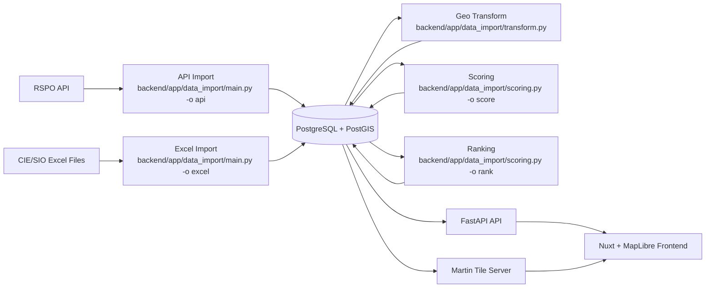

# EduRadar

[](README.md)
[](README.pl.md)

EduRadar is an interactive map app for exploring Polish schools using official education datasets. It combines a FastAPI + PostgreSQL backend with batch data ingestion and score normalization (0-100), then serves filterable ranking and location data to a Nuxt frontend with interactive MapLibre visualizations.

## 🛠️ Tech stack:

- **Frontend:** Nuxt 4, Vue 3, TypeScript, Tailwind CSS
- **Backend:** FastAPI, PostgreSQL, SQLModel
- **Map:** MapLibre GL (via Vue MapLibre) + OpenFreeMap
- **Martin** for map tile rendering
- **Package Managers:** pnpm (Frontend), uv (Backend)
- **Containers:** Docker with Docker Compose Watch

## 📦 Project structure

- [`frontend/README.md`](frontend/README.md) – frontend setup, Nuxt specifics
- [`backend/README.md`](backend/README.md) – backend setup, FastAPI & database details

## ETL Pipeline

This project uses **two separate ingestion pipelines** that are joined by the school RSPO number:

1. **RSPO API pipeline (school registry data)**

- Source: authenticated [RSPO API](https://api.rspo.gov.pl/api/placowki/) (paginated JSON).
- Scope: active and closed schools, with administrative hierarchy and geolocation.
- Processing: API responses are validated with Pydantic models and decomposed into normalized relational tables (e.g. `wojewodztwo`, `powiat`, `gmina`, `miejscowosc`, `ulica`, school metadata).
- Persistence: schools are upserted by `numer_rspo`; existing records are updated (including relationships and geometry).

2. **CIE/SIO pipeline (exam results data)**

- Source: Excel files (`E8_data`, `EM_data`) from CIE/SIO exam publications: [Exams map](https://mapa.wyniki.edu.pl/MapaEgzaminow/).
- Processing: files are parsed per exam type (`E8`, `EM`), subjects are extracted from multi-level headers, and results are matched to schools by RSPO.
- Validation: result payloads are validated before insert; incomplete rows are skipped.
- Persistence: results are bulk inserted into `wynik_e8` / `wynik_em` with conflict-safe deduplication (`szkola_id`, `przedmiot_id`, `rok`).

3. **Geospatial transform pipeline (optional but supported)** (this was used in the early stages when location data for schools from the RSPO API was inaccurate)

- Export school addresses to CSV for external geocoding.
- Geocode addresses using a [Polish geocoding service](https://capap.gugik.gov.pl/app/geokodowanie/file.html)
- Import converted coordinates back to PostGIS geometry.

4. **Shifting overlapping schools**

- Shift overlapping map points to reduce marker stacking.

5. **Scoring and ranking pipeline**

- School scores (`0-100`) are recalculated from exam tables using weighted subjects, multi-year decay, and fallback rules when median values are missing.
- Rankings are rebuilt for the latest available year at national, voivodeship, and powiat levels.
- EM rankings are split into `EM_TECH` and `EM_LO` groups based on school type.

6. **Serving layer**

- Final data is stored in PostgreSQL/PostGIS and consumed by:
- FastAPI endpoints (filtering/search/rankings).
- Martin vector tile server for map rendering. [Martin](https://martin.maplibre.org/) create MVT (Mapbox Vector Tiles) from any PostGIS table on the fly.

## Architecture Diagram



## Performance Notes

- ETL uses batch processing to handle large datasets (50k+ schools) without loading everything into memory at once.
- RSPO ingestion fetches paginated data concurrently and writes normalized entities with cache-aware decomposition.
- Exam ingestion uses buffered bulk inserts and conflict-safe deduplication on (`szkola_id`, `przedmiot_id`, `rok`).
- Score updates are executed in bulk (`UPDATE ... bind params`) instead of row-by-row updates.
- Rankings are rebuilt from latest-year data with set-based queries and pre-grouped position calculations.
- Map delivery is optimized via Martin vector tiles generated directly from PostGIS tables.
- API filtering/searching/pagination are backend-driven to keep payloads small and map rendering responsive.

## ⚙️ Configuration

Before running the project, configure the following env files (copy from the provided examples and fill in your values):

- [`backend/.env.example`](backend/.env.example) — app credentials, including RSPO API credentials required for data fetching
- [`frontend/.env.example`](frontend/.env.example) — API URL (defaults to `http://localhost:8000`) and [Martin](https://martin.maplibre.org/) tile server URL
- [`backend/martin/.env.example`](backend/martin/.env.example) — PostgreSQL connection URL for Martin

---

## 🐳 Development - Running the project with Docker

### Docker files used

- `compose.yaml` — shared base config (prod-safe defaults)
- `compose.override.yaml` — development overrides (auto-loaded by Docker Compose)
- `compose.prod.yaml` — explicit production overlay

### 1. Prerequisites

- **Windows/macOS:** Install [Docker Desktop](https://www.docker.com/products/docker-desktop).
- **Linux:** Install [Docker Engine](https://docs.docker.com/engine/install/) and the [Docker Compose plugin](https://docs.docker.com/compose/install/).

### 2. Clone the repository:

```bash
git clone https://github.com/neogib/edu-radar.git
cd edu-radar
```

### 3. Running the project with docker (first time & development)

For the initial setup and the best development experience (automatic file sync and rebuilds), run:

```bash
docker compose up --build --watch
```

This will build the images, start all services, and watch files defined in `develop.watch`.

---

### 4. Running the project in production mode

Build all production images:

```bash
docker compose -f compose.yaml -f compose.prod.yaml build
```

Start all services in background:

```bash
docker compose -f compose.yaml -f compose.prod.yaml up -d
```

Stop production services:

```bash
docker compose -f compose.yaml -f compose.prod.yaml down
```

---

### Stopping the services

To stop **and remove** containers, networks, and related resources:

```bash
docker compose down
```

If you only want to stop containers without removing them:

```bash
docker compose stop
```
