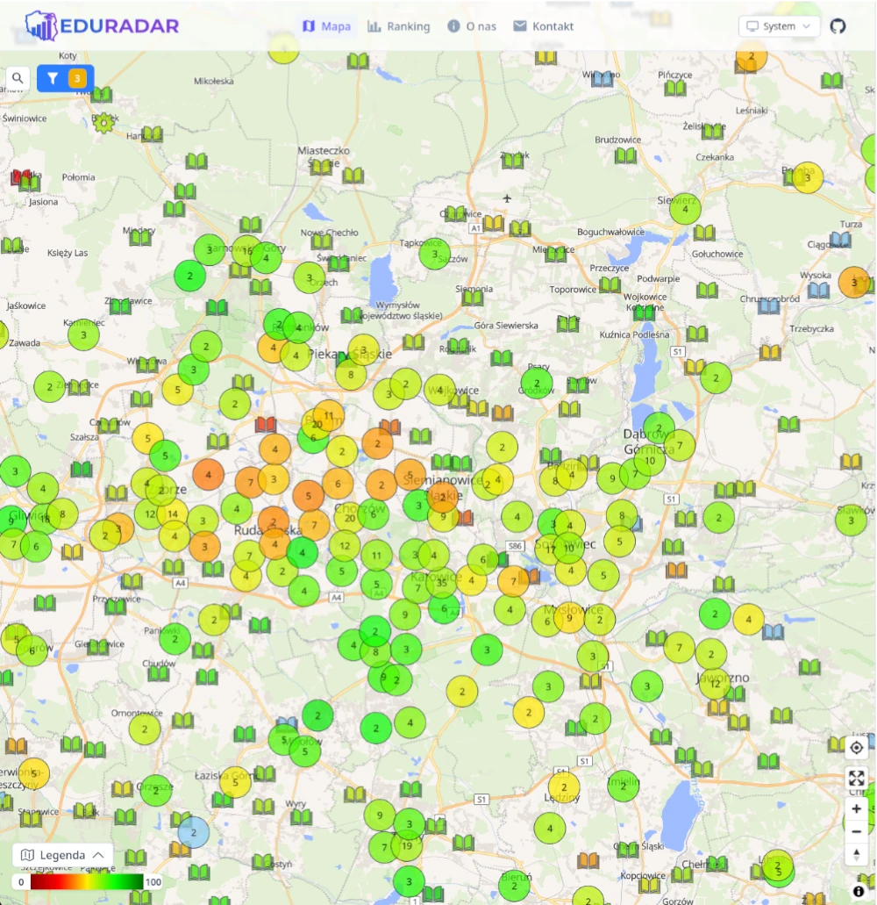
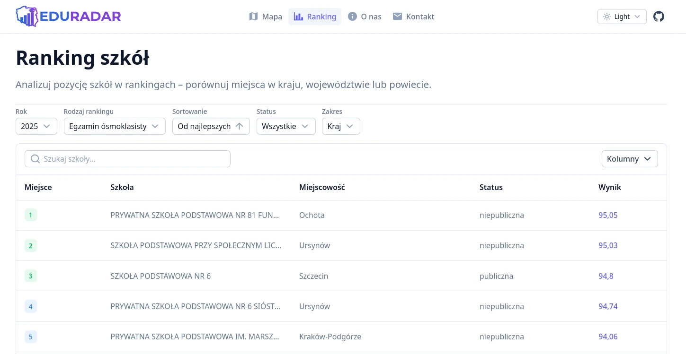
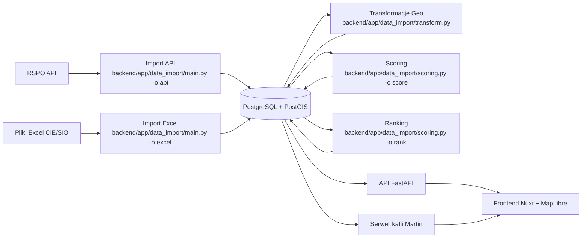

# EduRadar

[](README.md)
[](README.pl.md)

EduRadar to interaktywna mapa do eksploracji polskich szkół na podstawie oficjalnych danych edukacyjnych. Łączy backend FastAPI + PostgreSQL z wsadowym importem danych i normalizacją wyników (0-100), a następnie udostępnia filtrowalne dane rankingowe i lokalizacyjne do frontendu Nuxt z interaktywną wizualizacją MapLibre.

## 🎬 Demo


### Zrzuty ekranu

- 
- 

## 🛠️ Tech Stack:

- **Frontend:** Nuxt 4, Vue 3, TypeScript, Tailwind CSS
- **Backend:** FastAPI, PostgreSQL, SQLModel
- **Mapa:** MapLibre GL (przez Vue MapLibre) + OpenFreeMap
- **Martin** do renderowania kafli mapowych
- **Menedżery pakietów:** pnpm (Frontend), uv (Backend)
- **Kontenery:** Docker z Docker Compose Watch

## 📦 Struktura projektu

- [`frontend/README.md`](frontend/README.md) – konfiguracja frontendu, szczegóły Nuxt
- [`backend/README.md`](backend/README.md) – konfiguracja backendu, szczegóły FastAPI i bazy danych

## Pipeline ETL

Projekt korzysta z **dwóch niezależnych pipeline'ów importu danych**, które są łączone po numerze RSPO szkoły:

1. **Pipeline RSPO API (dane rejestrowe szkół)**

- Źródło: uwierzytelnione [RSPO API](https://api.rspo.gov.pl/api/placowki/) (stronicowany JSON).
- Zakres: szkoły aktywne i zlikwidowane, wraz z hierarchią administracyjną i geolokalizacją.
- Przetwarzanie: odpowiedzi API są walidowane modelami Pydantic i dekomponowane do znormalizowanych tabel relacyjnych (np. `wojewodztwo`, `powiat`, `gmina`, `miejscowosc`, `ulica`, metadane szkoły).
- Zapis: szkoły są upsertowane po `numer_rspo`; istniejące rekordy są aktualizowane (w tym relacje i geometria).

2. **Pipeline CIE/SIO (wyniki egzaminów)**

- Źródło: pliki Excel (`E8_data`, `EM_data`) z publikacji CIE/SIO: [Mapa egzaminów](https://mapa.wyniki.edu.pl/MapaEgzaminow/).
- Przetwarzanie: pliki są parsowane per typ egzaminu (`E8`, `EM`), przedmioty są wyciągane z wielopoziomowych nagłówków, a wyniki dopasowywane do szkół po RSPO.
- Walidacja: payloady wyników są walidowane przed zapisem; niekompletne wiersze są pomijane.
- Zapis: wyniki są hurtowo zapisywane do `wynik_e8` / `wynik_em` z bezpieczną deduplikacją konfliktów (`szkola_id`, `przedmiot_id`, `rok`).

3. **Geospatial transform pipeline (opcjonalny, ale wspierany)** (używany we wcześniejszym etapie, gdy dane lokalizacyjne szkół z RSPO API były niedokładne)

- Eksport adresów szkół do CSV pod zewnętrzne geokodowanie.
- Geokodowanie adresów z użyciem [polskiej usługi geokodowania](https://capap.gugik.gov.pl/app/geokodowanie/file.html).
- Import przeliczonych współrzędnych z powrotem do geometrii PostGIS.

4. **Przesuwanie nakładających się szkół**

- Przesuwanie nakładających się punktów na mapie, aby ograniczyć nakładanie markerów.

5. **Pipeline scoringu i rankingów**

- Wyniki szkół (`0-100`) są przeliczane z tabel egzaminacyjnych z użyciem wag przedmiotów, zaniku między latami i reguł zastępczych, gdy brakuje mediany.
- Rankingi są przebudowywane dla najnowszego dostępnego roku na poziomie krajowym, wojewódzkim i powiatowym.
- Rankingi EM są rozdzielane na grupy `EM_TECH` i `EM_LO` według typu szkoły.

6. **Warstwa udostępniania danych**

- Dane końcowe są przechowywane w PostgreSQL/PostGIS i konsumowane przez:
- Endpointy FastAPI (filtrowanie/wyszukiwanie/rankingi).
- Serwer kafli wektorowych Martin do renderowania mapy. [Martin](https://martin.maplibre.org/) tworzy MVT (Mapbox Vector Tiles) z dowolnej tabeli PostGIS w locie.

## Diagram architektury



## Uwagi wydajnościowe

- ETL używa przetwarzania wsadowego, aby obsłużyć duże zbiory danych (50k+ szkół) bez wczytywania wszystkiego do pamięci naraz.
- Import RSPO pobiera stronicowane dane równolegle i zapisuje znormalizowane encje z cache-aware dekompozycją.
- Import wyników egzaminów używa buforowanych insertów hurtowych oraz deduplikacji konfliktów na (`szkola_id`, `przedmiot_id`, `rok`).
- Aktualizacje scoringu są wykonywane hurtowo (`UPDATE ... bind params`), zamiast aktualizacji rekord po rekordzie.
- Rankingi są przebudowywane na danych z najnowszego roku przy użyciu zapytań zbiorczych i wstępnie grupowanych pozycji.
- Dostarczanie warstwy mapowej jest optymalizowane przez kafle wektorowe Martina generowane bezpośrednio z tabel PostGIS.
- Filtrowanie/wyszukiwanie/paginacja są realizowane po stronie backendu, aby utrzymać małe payloady i responsywne renderowanie mapy.

## ⚙️ Konfiguracja

Przed uruchomieniem projektu skonfiguruj poniższe pliki env (skopiuj z przykładów i uzupełnij własnymi wartościami):

- [`backend/.env.example`](backend/.env.example) — dane dostępowe aplikacji, w tym poświadczenia RSPO API wymagane do pobierania danych
- [`frontend/.env.example`](frontend/.env.example) — URL API (domyślnie `http://localhost:8000`) oraz URL serwera kafli [Martin](https://martin.maplibre.org/)
- [`backend/martin/.env.example`](backend/martin/.env.example) — URL połączenia PostgreSQL dla Martina

---

## 🐳 Development - uruchamianie projektu w Dockerze

### Używane pliki Docker Compose

- `compose.yaml` — wspólna konfiguracja bazowa (bezpieczne domyślne ustawienia prod)
- `compose.override.yaml` — nadpisania developerskie (automatycznie ładowane przez Docker Compose)
- `compose.prod.yaml` — dodatkowa nakładka produkcyjna

### 1. Wymagania

- **Windows/macOS:** zainstaluj [Docker Desktop](https://www.docker.com/products/docker-desktop).
- **Linux:** zainstaluj [Docker Engine](https://docs.docker.com/engine/install/) oraz [wtyczkę Docker Compose](https://docs.docker.com/compose/install/).

### 2. Sklonuj repozytorium:

```bash
git clone https://github.com/neogib/edu-radar.git
cd edu-radar
```

### 3. Uruchomienie projektu w Dockerze (pierwsze uruchomienie i development)

Dla pierwszego uruchomienia i najlepszego doświadczenia developerskiego (automatyczny sync plików i przebudowa) uruchom:

```bash
docker compose up --build --watch
```

To polecenie zbuduje obrazy, uruchomi wszystkie serwisy i będzie obserwować pliki zdefiniowane w `develop.watch`.

---

### 4. Uruchamianie projektu w trybie produkcyjnym

Zbuduj obrazy produkcyjne:

```bash
docker compose -f compose.yaml -f compose.prod.yaml build
```

Uruchom wszystkie serwisy w tle:

```bash
docker compose -f compose.yaml -f compose.prod.yaml up -d
```

Zatrzymaj serwisy produkcyjne:

```bash
docker compose -f compose.yaml -f compose.prod.yaml down
```

---

### Zatrzymywanie serwisów

Aby zatrzymać **i usunąć** kontenery, sieci i powiązane zasoby:

```bash
docker compose down
```

Jeśli chcesz tylko zatrzymać kontenery bez ich usuwania:

```bash
docker compose stop
```
